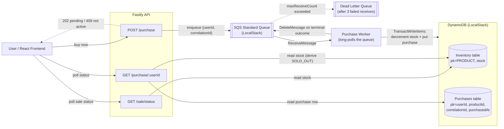

# Flash Sale System

A high-throughput flash sale backend + frontend built for a Bookipi take-home assessment: thousands of users can attempt to buy one unit of a single limited-stock product, with strict "one item per user" and "no overselling" guarantees under concurrent load.

See also: [plan.md](plan.md) (build plan & rationale log), [TEST_CASES.md](TEST_CASES.md) (21 documented test cases), [DEMO_GUIDE.md](DEMO_GUIDE.md) (step-by-step live-demo script), [STRESS_TEST_RESULTS.md](STRESS_TEST_RESULTS.md) (load test results), [CLAUDE.md](CLAUDE.md) (assessment brief + working agreement, including the follow-up technical interview context).

## Architecture



**Flow:**
1. `POST /purchase` validates the sale window is `active`, then enqueues a message and immediately returns `202 { status: "pending" }` — it never talks to DynamoDB directly.
2. A separate **worker** process long-polls SQS and, for each message, runs a single DynamoDB `TransactWriteItems` call that atomically (a) decrements `stock` only if `stock > 0`, and (b) creates a purchase record only if the user doesn't already have one. A message that keeps failing (not a business rejection — an actual error) is redirected to a **dead-letter queue** after 3 failed receives instead of retrying forever (see [Dead-letter queue](#dead-letter-queue-for-poison-messages) below).
3. `GET /purchase/:userId` derives the user's status by reading DynamoDB directly (no queue involved) — see [Design choices](#design-choices--trade-offs) for how `PENDING` / `SOLD_OUT` / `PURCHASED` / `NOT_PURCHASED` are derived without a 3rd table.

## Design choices & trade-offs

### Concurrency control: DynamoDB conditional transaction, not app-level locks

All correctness (no overselling, no double-purchase) comes from one `TransactWriteItems` call in [`backend/src/domain/purchase.ts`](backend/src/domain/purchase.ts):

```
TransactWriteItems:
  1) Update Inventory: SET stock = stock - 1  WHERE stock > 0
  2) Put Purchases item (pk=userId)            WHERE NOT exists
```

If either condition fails, the *whole* transaction is rolled back atomically and DynamoDB tells us exactly which condition failed (via `CancellationReasons`), so we can distinguish `SOLD_OUT` from `ALREADY_PURCHASED` in one round trip. There's no mutex, no `SELECT ... FOR UPDATE`, and no distributed lock to reason about — this is the standard AWS reference pattern for limited-inventory systems, and it scales horizontally (any number of API/worker instances can call it safely).

### Why a queue (SQS) in front of the transaction

The transaction above is already safe without a queue. The queue's job is purely to **absorb bursts**: `POST /purchase` returns instantly regardless of load, and the worker(s) drain the queue at a sustainable rate. This also gives us a concrete fault-tolerance story: if a worker crashes mid-processing, the message's SQS visibility timeout expires and another worker (or the same one, restarted) picks it up automatically — no purchase is lost (see [TEST_CASES.md](TEST_CASES.md) TC-F1-F3).

We use **Standard** (not FIFO) SQS. FIFO exists to prevent duplicate/out-of-order processing, but our DynamoDB transaction is already safe against duplicate or concurrent delivery of the same logical purchase — the conditional `Put` simply fails the second time. Standard queues have no such ordering constraint and a materially higher throughput ceiling, so there's no reason to pay FIFO's cost here.

### Idempotency under SQS's at-least-once delivery

SQS Standard guarantees **at-least-once** delivery — a message can be redelivered, most notably if a worker crashes *after* the DynamoDB transaction succeeds but *before* it calls `DeleteMessage`:

```
Message received -> transaction succeeds -> worker crashes before DeleteMessage
  -> SQS visibility timeout expires -> message redelivered -> attemptPurchase() runs again
```

This is safe by construction, not by luck: the second attempt hits the exact same `ConditionExpression: attribute_not_exists(pk)` on the `Purchases` table, which now fails because the row already exists from the first attempt. `attemptPurchase()` resolves this to `ALREADY_PURCHASED` — a normal terminal outcome, not an error — and the worker deletes the (now-processed-twice) message. Stock is never double-decremented because the `Update` on `Inventory` is part of the *same* atomic transaction as the `Put`; if the `Put` fails, the whole transaction (including the decrement) rolls back. No dedup table, no idempotency key, no FIFO message-group needed — the same conditional write that enforces "one purchase per user" also makes redelivery safe for free.

### Dead-letter queue for poison messages

The main queue has a `RedrivePolicy` (`maxReceiveCount: 3`, see [`backend/src/config.ts`](backend/src/config.ts) and [`backend/src/aws/provision.ts`](backend/src/aws/provision.ts)) pointing at a dedicated DLQ. Business rejections (`SOLD_OUT`, `ALREADY_PURCHASED`) are terminal outcomes and always get deleted immediately — they never count against this limit. Only messages that repeatedly throw an *unexpected* error (a real bug, a persistent DynamoDB outage, a malformed body) get redirected to the DLQ after 3 failed attempts, instead of cycling through the main queue forever and slowing down real traffic.

### Why the purchase endpoint is asynchronous (202 + poll)

`POST /purchase` doesn't wait for the worker — it returns `202 { status: "pending" }` immediately, and the client polls `GET /purchase/:userId` for the outcome. This is what makes the queue's burst-absorption actually visible to the client (a synchronous design would just move the queueing delay into the HTTP request itself), and it reuses the *already-required* "check my purchase result" endpoint as the polling target instead of inventing a second mechanism.

### Why `GET /purchase/:userId` doesn't need a 3rd table

We only write a `Purchases` row on **success**. So a missing row plus the current sale/stock state is enough to derive everything:

| Purchases row exists? | Sale ended? | Stock == 0? | Result |
|---|---|---|---|
| yes | – | – | `PURCHASED` |
| no | yes | – | `NOT_PURCHASED` |
| no | no | yes | `SOLD_OUT` |
| no | no | no | `PENDING` |

This avoids tracking every failed attempt just to answer "did I get one?". Note the `Sale ended?` check runs *before* the stock check in code — sale-timing and inventory are independent concerns, so stock remaining > 0 after the sale ends (e.g. it undersold) correctly reports `NOT_PURCHASED`, not a misleading `SOLD_OUT` (see the comment in [`backend/src/routes/purchase.ts`](backend/src/routes/purchase.ts) and test `TC-D3`).

Each `Purchases` row also stores `productId` (hardcoded `"PRODUCT"` — the extension point if this ever supports multiple products) and the `correlationId` of the winning attempt, so a purchase can be traced straight back to its log lines without depending on log retention.

### Frontend UX: check-before-buy

Before enqueuing, [`PurchaseForm`](frontend/src/components/PurchaseForm.tsx) first calls `GET /purchase/:userId`. If the user already has a `PURCHASED` row, the UI shows "already secured" instantly without touching the queue at all. This is a pure UX optimization — the backend's own duplicate-rejection (via the conditional `Put`) is what actually enforces one-per-user; the frontend check just avoids a redundant round trip for the common case.

### LocalStack instead of real AWS

DynamoDB and SQS run in [LocalStack](https://www.localstack.io/) via `docker-compose.yml` — no real AWS account or costs required, while still exercising the real `@aws-sdk/*` clients against a real (if long-poll simplified) DynamoDB/SQS implementation. To point this at real AWS, remove the `endpoint` override in [`backend/src/aws/clients.ts`](backend/src/aws/clients.ts) and supply real IAM credentials — no other code changes needed. **Known limitation:** LocalStack's state is in-memory only (no volume mounted), so it resets on `docker compose down`; acceptable for a take-home, but a production LocalStack-based CI setup would mount a persistence volume or just target a real AWS test account.

### Observability: correlation IDs

Every purchase attempt gets a `correlationId` (UUID) generated in the API, carried through the SQS message body, and logged at every stage in both the API and the worker (via a shared `pino` logger — see [`backend/src/logger.ts`](backend/src/logger.ts)). Grepping one `correlationId` shows the full lifecycle across both processes: `purchase attempt received` → `enqueued` → `message received from queue` → `purchase transaction completed` → `message deleted from queue`. The worker also logs queue depth per batch, useful for observing backpressure during the stress test. See [TEST_CASES.md](TEST_CASES.md) TC-G1/G2.

### Scaling & bottleneck notes

- **API layer**: Fastify is stateless — horizontally scalable behind a load balancer with no code changes.
- **Worker layer**: multiple worker processes can safely consume the same queue concurrently; correctness is guaranteed by the DynamoDB transaction, not by having a single consumer. More workers = higher drain rate under burst.
- **DynamoDB**: `PAY_PER_REQUEST` billing mode auto-scales; the only hot key is the single `Inventory` item (`pk=PRODUCT`), which is an inherent bottleneck for *any* single-product-counter design — at extreme scale this would be sharded into N counters that sum to the total stock, at the cost of more complex "is it sold out" logic. Not implemented here as it would be premature for this scale/scope, but it's the natural next optimization.
- **Queue**: SQS Standard scales far beyond what a single-product flash sale needs; the real ceiling in this take-home's local environment is the single LocalStack container and single machine running everything, not the architecture itself.

## API reference

| Method | Path | Description | Success | Failure |
|---|---|---|---|---|
| GET | `/sale/status` | Current sale status + stock remaining | `200 { status, startsAt, endsAt, stockRemaining }` | — |
| POST | `/purchase` | Attempt to buy one unit | `202 { status: "pending" }` | `400` missing `userId`; `409 { status: "SALE_NOT_ACTIVE", saleStatus }` if not active |
| GET | `/purchase/:userId` | Check a user's purchase outcome | `200 { status: "PURCHASED" \| "SOLD_OUT" \| "NOT_PURCHASED" \| "PENDING", purchasedAt? }` | — |

## Project structure

```
backend/         Fastify API + SQS worker + DynamoDB provisioning (TypeScript)
frontend/        Vite + React + TS UI
shared/           Shared TS types for the API contract (@flash-sale/shared)
stress-test/      Standalone HTTP load-test script (@flash-sale/stress-test)
docker-compose.yml  LocalStack (DynamoDB + SQS)
```

## Prerequisites

- Node.js **v24.21.0** (see [`.nvmrc`](.nvmrc)) — `nvm use` if you have nvm-windows/nvm installed.
- **pnpm** (via corepack: `corepack enable pnpm`).
- **Docker** (for LocalStack).

## Setup & run

```bash
# 1. Install dependencies (all workspaces)
pnpm install

# 2. Start LocalStack (DynamoDB + SQS)
docker compose up -d

# 3. Create tables/queue and seed inventory (idempotent, safe to re-run)
cd backend
pnpm run setup:aws

# 4. Start the API (separate terminal)
pnpm run dev

# 5. Start the worker (separate terminal)
pnpm run worker

# 6. Start the frontend (separate terminal, from repo root)
cd ../frontend
pnpm run dev
```

The frontend runs on whatever port Vite picks (usually `http://localhost:5173`) and proxies `/sale` and `/purchase` to the API at `http://localhost:3000` (see [`frontend/vite.config.ts`](frontend/vite.config.ts)) — no CORS configuration needed for local dev.

Configuration is via `backend/.env` (see [`backend/.env.example`](backend/.env.example) for all variables and their defaults — the app runs with sane defaults even without a `.env` file). Notably `SALE_START`/`SALE_END` (ISO timestamps) and `STOCK_QUANTITY`.

## Testing

```bash
cd backend

pnpm run test              # unit tests (no AWS dependency, mocked SDK)
pnpm run test:integration   # integration tests against real LocalStack (requires docker compose up)
pnpm run typecheck          # full TypeScript check, including test files
```

- **Unit tests** (11): pure `saleWindow` logic + `attemptPurchase` outcome mapping (including the stored `productId`/`correlationId`) with `aws-sdk-client-mock`.
- **Integration tests** (11, real LocalStack, isolated `*Test`-suffixed tables/queue so they never clobber your dev data): full HTTP flow, input validation, derived statuses, and dedicated concurrency races proving exactly one winner when N requests race for the same user or the last unit of stock.

Full case-by-case mapping (setup/steps/expected/which test covers it) is in [TEST_CASES.md](TEST_CASES.md).

## Postman collection

[`postman/flash-sale.postman_collection.json`](postman/flash-sale.postman_collection.json) + [`postman/local.postman_environment.json`](postman/local.postman_environment.json) — import both into Postman (or run headlessly with `npx newman run postman/flash-sale.postman_collection.json -e postman/local.postman_environment.json`), select the "Flash Sale - Local" environment, and run. Requests are organized into folders matching [TEST_CASES.md](TEST_CASES.md)'s categories (A-E) with built-in assertions; two requests (sold-out, sale-not-active) document the manual precondition they need (exhausted stock / inactive sale window) and will fail their assertion otherwise — that's expected, not a bug.

## Stress test

```bash
# from repo root, with the API + worker already running
cd backend
STOCK_QUANTITY=100 pnpm run reset-stock   # deterministic starting stock
cd ..
TOTAL_REQUESTS=1000 pnpm run stress-test
```

**Actual result:** 1000 concurrent `POST /purchase` requests (batched at 200 in-flight at a time; 949 unique users + 51 intentional duplicate-user requests) against a starting stock of 100 →

```
PURCHASED: 100   SOLD_OUT: 849   errors: 0
✅ No overselling: 100 purchased <= starting stock of 100
```

Full numbers, latency percentiles, and interpretation: [STRESS_TEST_RESULTS.md](STRESS_TEST_RESULTS.md).

## Known limitations / scope exclusions

- No real AWS deployment — LocalStack only (see [plan.md](plan.md) for the prod-swap notes).
- No authentication — `userId` is a free-text identifier, no sessions/passwords, per the assessment scope.
- No payment processing (out of scope).
- Single hot `Inventory` counter item — the deliberate bottleneck discussed above; sharding is the natural next step at larger scale.
- LocalStack state is ephemeral (no persistence volume) — resets on `docker compose down`.
